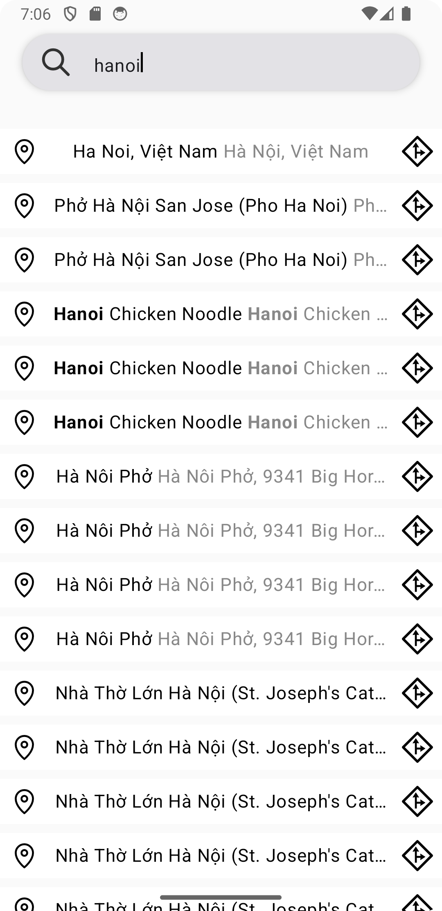

# Test application for Mobile Intern Position at NewWave Solution 
A sample Android application demonstrating location search and mapping using HERE SDK and Google Maps, built with Jetpack Compose.

# Features
- Search for locations using HERE SDK
- Display results in a Compose-based UI
- Open locations in Google Maps
- Highlight keywords in search results

# Tech Used
- Android Studio
- Kotlin
- Jetpack Compose
- Google Maps & HERE API
- Fused Location Provider (for GPS)

# Pattern Used
- MVVM (Model-View-ViewModel)
* Model:
  - Handles the data sources — HERE SDK, Google Maps, or any other API. Encapsulates business logic and data retrieval.
* ViewModel:
  - Acts as the bridge between the Model and the View.
  - Exposes data as MutableState / StateFlow for Compose to observe.
  - Handles logic like keyword highlighting, search throttling, or API calls.
* View (Jetpack Compose UI):
  - Observes the State from ViewModel.
  - Declaratively updates UI when the state changes.
  - Stateless composables that just render what the ViewModel provides.

# Demo
[Demo video](https://drive.google.com/uc?export=view&id=14gakCtmygbW6ZTf3MlNpLe4vFuopK1US)

# Screenshot

